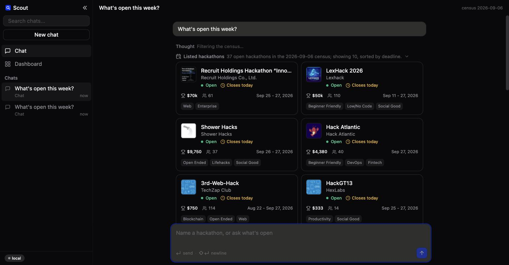
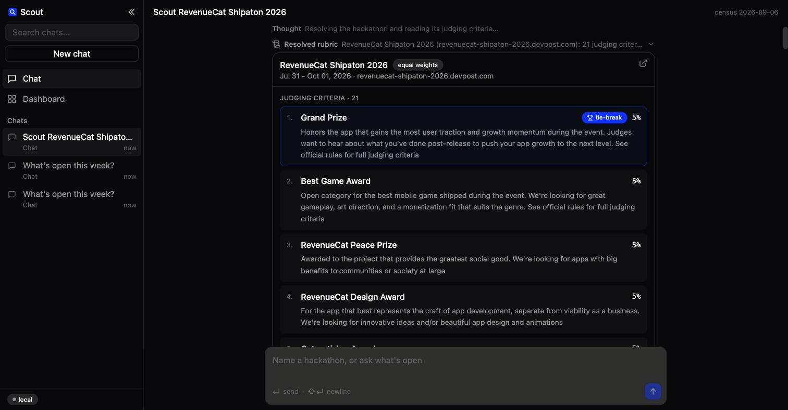
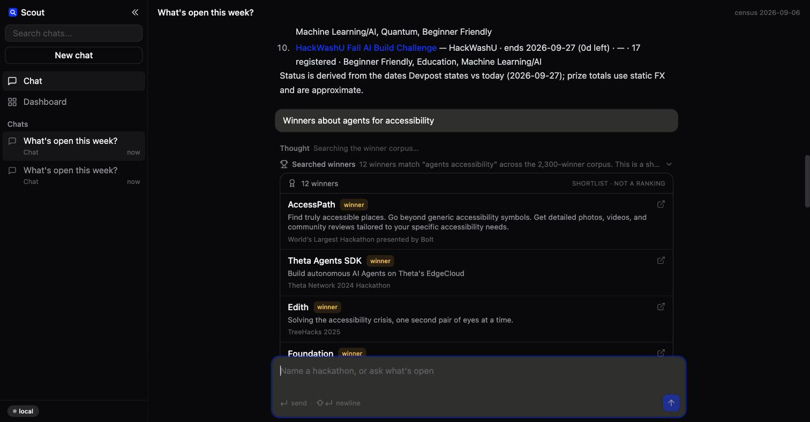
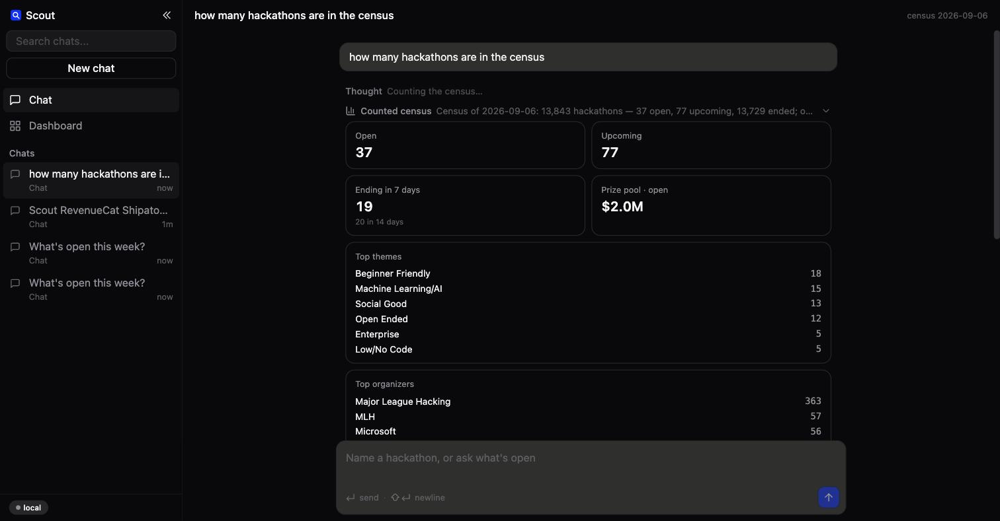
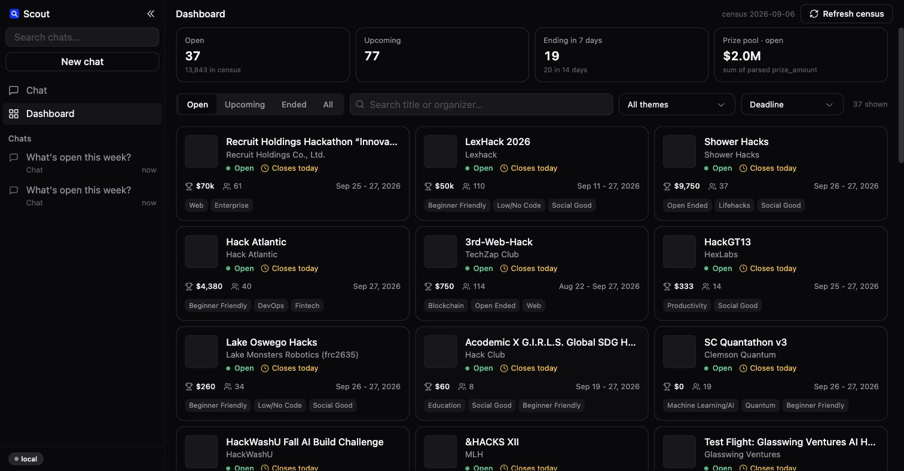
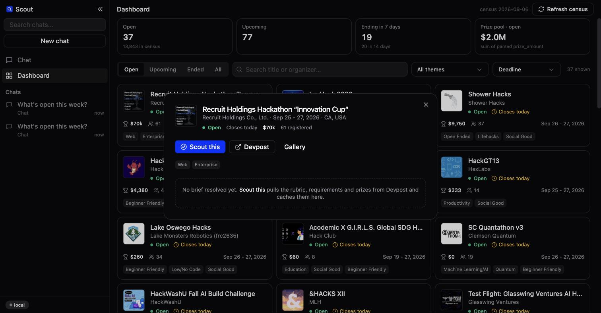

<h1 align="center">Scout</h1>

<p align="center">
  <a href="https://github.com/yc9954/devpost-scout"></a>
  
  
  
  <a href="LICENSE"></a>
</p>

<p align="center">
  <strong>One chat agent and one dashboard for entering a Devpost hackathon on evidence, not optimism.</strong><br/>
  Scout wraps a hackathon-research toolkit — a census of every hackathon Devpost lists, a corpus of 2,300 winning projects,<br/>
  a rubric parser that reads judging criteria verbatim, and an idea generator that scores proven mechanisms against the rubric —<br/>
  into a single product you talk to. Every number it returns is measured or quoted from Devpost; when a number is weak, it says so.
</p>

<h3 align="center"><a href="#getting-started"><ins>Getting started</ins></a> · <a href="METHOD.md">The method</a> · <a href="PITFALLS.md">Pitfalls</a></h3>

<p align="center">
  
</p>

## Features

<table>
<tr>
<td width="50%" valign="middle">

### Ask what is open this week

The agent calls `list_hackathons(status=open, sort=deadline)` and the tool row expands into hackathon cards: thumbnail, organiser, derived status, countdown, parsed prize, registrations, themes. The prose that follows restates the same numbers.

Status is derived from the dates Devpost states against today, not from the census snapshot flag.

</td>
<td width="50%">
  
</td>
</tr>
<tr>
<td width="50%" valign="middle">

### Scout a hackathon by name

`hackathon_brief` resolves the host on Devpost and parses the rubric. The card lists every criterion with its weight and highlights the tie-break criterion (Devpost resolves ties on the first-listed criterion, so it decides placements in a bunched field). Requirements that fail an entry outright are listed too.

On the page shown, Devpost lists 21 prize categories under *Judging Criteria*; the parser reports exactly what the page says.

</td>
<td width="50%">
  
</td>
</tr>
<tr>
<td width="50%" valign="middle">

### Shortlist winners, never rank them

`search_winners` is FTS5 over title and tagline of the 2,300-winner corpus. The card is labelled *shortlist, not a ranking* and the prose repeats the warning every time, because a match over 100-character taglines cannot rank anything.

</td>
<td width="50%">
  
</td>
</tr>
<tr>
<td width="50%" valign="middle">

### Census statistics in the chat

`census_stats` renders the same tiles the dashboard uses, plus top themes, top organisers and the deadlines of the next 14 days.

</td>
<td width="50%">
  
</td>
</tr>
<tr>
<td width="50%" valign="middle">

### A dashboard over the whole census

Open / upcoming / ending-in-7-days / prize-pool tiles, status tabs, theme filter, search, sort by deadline, prize or registrations, thumbnails and deadline countdowns. A **Refresh census** button re-runs the ~1,540-request Devpost census in the background with a progress bar and swaps the file in only when the collector exits cleanly.

</td>
<td width="50%">
  
</td>
</tr>
<tr>
<td width="50%" valign="middle">

### Detail, then Scout this

Click a card for the organiser, dates, prize, registrations, links to Devpost and the gallery, and the brief once it has been resolved. **Scout this** opens a chat with `scout <title>` and runs brief → field → ideate as a background job.

</td>
<td width="50%">
  
</td>
</tr>
</table>

Screenshots were taken in local mode against the committed data (census of 2026-09-06, viewed on 2026-09-27); Claude mode renders the same cards with model-written prose.

**Also included**

- **Idea generation against the rubric**: `ideate` scores every mechanism × domain pair from 8,636 faceted winners against the cached brief and reports expected wins with the evidence projects behind each candidate.
- **Honest by construction**: prize totals use static FX and say so, an unpublished gallery is reported as *unmeasured* rather than empty, and under-occupancy claims carry the caveat that they are measured against independence in a regex taxonomy. Every rule comes from [`PITFALLS.md`](PITFALLS.md), where each one was paid for once.
- **Two modes, one event stream**: without an API key Scout runs a deterministic router with templated prose; with `ANTHROPIC_API_KEY` Claude picks the tools and writes the prose. The UI, cards and persisted transcripts are identical.
- **An Obsidian vault** of 13,599 notes (projects, mechanisms, domains, hackathons, claims, convergences, gaps) that `vault_lookup` greps.
- **A `/scout` skill** in `.claude/skills/scout/` that drives the same pipeline from Claude Code, and `scout.py` that runs it from a terminal.

---

## How it works

```text
browser (web/dist — React 19, 1code UI kit, zustand)
   │  GET /api/…  ·  POST /api/chats/{id}/messages → SSE
   ▼
scout/server.py     ThreadingHTTPServer (stdlib), static web/dist + SPA fallback, SSE with replay
   ├─ scout/data.py         census (13,843 rows) + winners FTS + facets + brief cache, all in memory
   ├─ scout/tools.py        the eight tools → {ok, summary, data}
   ├─ scout/local_agent.py  deterministic router → same event stream
   ├─ scout/agent.py        Claude mode: anthropic SDK, claude-opus-5, adaptive thinking, streaming tool loop
   ├─ scout/jobs.py         background jobs (scout pipeline, census refresh) with an event log
   └─ scout/config.py       .env loader, port, model, census date
        │
        ▼ wraps, never re-implements
discover/hackathon.py · hub/{store,collect_gallery,extract,ideate,collect_hackathons}.py · lib/fetch.py · vault/
```

1. **Message in.** `POST /api/chats/{id}/messages` opens an SSE stream. Both agents emit the same events: `message_start` → `thinking` → `tool_call {id, name, input}` → `tool_result {id, name, ok, summary, data}` → `text_delta` × n → `message_end`, with `job_progress` for long tools and `error` on failure.
2. **Route.** In local mode a deterministic router maps the text to a tool: "open / upcoming / deadline / prize" → `list_hackathons`; a hackathon name or URL → `hackathon_brief` (+ `ideate` when ideas are requested); "winners about Y" → `search_winners`; "mechanism / domain / gap Y" → `vault_lookup`; "stats / how many" → `census_stats`. In Claude mode the system prompt is the product's rules (measured numbers only, cite Devpost, shortlist ≠ rank, state the census date) and the model picks tools, running several in parallel when useful, up to 8 rounds.
3. **Tools wrap the toolkit.** Each tool in `scout/tools.py` calls the standalone scripts underneath and returns `{ok, summary, data}`; `data` is the card payload the UI renders. Tool failures go back as `tool_result` with `is_error` so the model can recover or say what it could not measure.
4. **Persist.** Transcripts are saved as JSON under `data/chats/` and reopen with their cards intact. Briefs and fields are cached under `data/run/`.

<details>
<summary><strong>The eight tools</strong></summary>

| Tool | What it wraps | Network | Notes |
| --- | --- | --- | --- |
| `list_hackathons` | in-memory census (`scout/data.py`) | no | status derived from dates; prize parsed by `hub.store.prize_parts`; sort by deadline / prize / registrations |
| `hackathon_brief` | `discover/hackathon.py` — `search()` + `build()` | **yes** | criteria verbatim with weights, `tiebreak_criterion`, requirements, prizes; cached in `data/run/briefs/` |
| `search_winners` | FTS5 `projects_fts` in `data/ideas.db` | no | 2,300 winners; summary always says *shortlist, not a ranking* |
| `field` | `hub/collect_gallery.collect()` | **yes** | the hackathon's own gallery; cached in `data/run/fields/`; an unpublished gallery is reported as unmeasured |
| `ideate` | `hub/ideate.generate()` over `data/facets.jsonl` | no | needs a cached brief; uses the cached field for that host when present |
| `vault_lookup` | grep over `vault/` notes | no | mechanisms, domains, gaps, projects |
| `census_stats` | in-memory census | no | counts, open prize pool, themes, organisers, deadlines in 14 days |
| `scout` | brief → field → ideate as a background job | **yes** | streamed progress; also `POST /api/jobs/scout` |

JSON schemas for all eight live in `SCHEMAS` in `scout/tools.py`. The full contract both halves implement is [`docs/SPEC.md`](docs/SPEC.md).

</details>

<details>
<summary><strong>The data underneath</strong></summary>

| File | Rows | What it is |
| --- | --- | --- |
| `data/hackathons_all.jsonl` | 13,843 | full census from Devpost's `/api/hackathons` (plain JSON, no pagination ceiling) |
| `data/hackathons.jsonl` | 1,863 | the rows with thumbnails and `time_left_to_submission`; merged over the census by id |
| `data/ideas.db` | 13,843 + 2,300 | SQLite: `hackathons` (prize in USD, state, dates, themes) and `projects` (winners) with an external-content FTS5 index |
| `data/facets.jsonl` | 8,636 | mechanism / domain / user / substrate facets per winning project, from `hub/extract.py` |
| `vault/` | 13,599 notes | Obsidian vault: projects, mechanisms, domains, hackathons, claims, convergences, gaps |

The census date is the mtime of `hackathons.jsonl` (2026-09-06). **Refresh census** in the dashboard, or `python3 hub/collect_hackathons.py --out data/hackathons.jsonl`, re-collects it. Status shown anywhere in the product is derived at request time from `submission_period_dates` against today's date; `census_state` keeps the snapshot value for comparison.

</details>

<details>
<summary><strong>The toolkit the product wraps</strong></summary>

Everything the product calls is a standalone script you can run on its own, written and priced during a real entry (The WebMCP Challenge, 2,392 submissions):

```text
discover/   resolve a hackathon (criteria, weights, tie-break, requirements, prizes); enumerate the field two independent ways
verify/     decide which projects are actually in this hackathon (membership is the page's own block, never a marker string)
position/   count how crowded your idea's pillars are before you build — five tests that kill an idea (position/IDEA-SELECTION.md)
score/      slice the corpus, fan out blind LLM judges, aggregate with error bars (double-judge one slice; report rank as a band)
hub/        the census, the winners gallery, the taxonomy, the vault, the gap finder, the idea generator
build/      film the demo (shoot flat, draw the camera afterwards), evidence discipline, the write-up, shipping
write/      what winning write-ups actually do; the four impact anchors
agents/     {{placeholder}} prompts that did the work
lib/        a CDP-driven Chrome and a WAF-aware fetch (Devpost answers concurrency with a 200-shaped challenge page)
runs/       one full run's dataset and findings (runs/webmcp-2026-09/)
```

Read [`METHOD.md`](METHOD.md) for the six-stage pipeline in order and [`PITFALLS.md`](PITFALLS.md) before trusting any number you produce.

</details>

---

## Tech stack

<p>
  <kbd>Python&nbsp;3.10+</kbd> &nbsp; <kbd>http.server&nbsp;(stdlib)</kbd> &nbsp; <kbd>SQLite&nbsp;FTS5</kbd> &nbsp; <kbd>Anthropic&nbsp;SDK</kbd> &nbsp; <kbd>websocket-client&nbsp;(CDP)</kbd> &nbsp;
  <kbd>React&nbsp;19</kbd> &nbsp; <kbd>TypeScript&nbsp;5</kbd> &nbsp; <kbd>Vite&nbsp;7</kbd> &nbsp; <kbd>Tailwind&nbsp;3</kbd> &nbsp; <kbd>zustand</kbd> &nbsp; <kbd>motion</kbd> &nbsp; <kbd>Radix&nbsp;UI</kbd> &nbsp; <kbd>lucide</kbd> &nbsp; <kbd>react-markdown</kbd> &nbsp;
  <kbd>21st-dev/1code&nbsp;UI&nbsp;kit</kbd> &nbsp; <kbd>Obsidian&nbsp;vault</kbd>
</p>

---

## Getting started

**Prerequisites**

- Python 3.10+. That is the whole install for local mode: the built UI (`web/dist`) and the data the product needs (`data/hackathons*.jsonl`, `data/ideas.db`, `data/facets.jsonl`, ~31 MB) are committed, so the app runs offline.
- Optional: an Anthropic API key and `pip install anthropic` for Claude mode.
- Optional: Node and npm to rebuild the UI; Google Chrome and `pip install -r requirements.txt` (`websocket-client`) for the toolkit scripts that drive Chrome over CDP, because Devpost's search and listing routes refuse plain HTTP clients.

```bash
git clone https://github.com/yc9954/devpost-scout && cd devpost-scout
./run.sh                      # builds web/ only if web/dist is missing, starts the server, opens http://127.0.0.1:8780
```

To let Claude drive the conversation instead, add a key and restart:

```bash
echo 'ANTHROPIC_API_KEY=sk-ant-…' > .env      # or export it
pip install anthropic                           # only needed for Claude mode
./run.sh                                        # sidebar badge switches from `local` to `claude`
```

Claude mode uses `claude-opus-5` with adaptive thinking and a streaming tool loop (up to 8 rounds, parallel tool calls answered together).

| Process | Port | Notes |
| --- | --- | --- |
| Scout server (API, SSE, built UI) | `8780` | `SCOUT_PORT`; binds to `127.0.0.1` |
| Vite dev server (`cd web && npm run dev`) | `5173` | proxies `/api` to `8780` |

| Variable | Default | What it does |
| --- | --- | --- |
| `ANTHROPIC_API_KEY` | unset | Present → Claude mode; absent → local mode. Read from `.env` or the environment. |
| `SCOUT_PORT` | `8780` | Server port. |
| `SCOUT_DATA_DIR` | `data/` | Where the census, winners DB, facets, briefs, fields and chats live. |
| `SCOUT_TODAY` | today | Override the date that status is derived against (used by tests). |

**Try these**

```text
What's open this week?
Scout RevenueCat Shipaton 2026
Winners about agents for accessibility
Give me ideas for <hackathon>            (runs ideate against the cached brief)
Stats
```

From a terminal, `python3 scout.py "revenuecat shipaton 2026" --deep 120` runs the same brief → field → ideate chain and prints the result.

<details>
<summary><strong>HTTP API</strong></summary>

| Route | Purpose |
| --- | --- |
| `GET /api/health` | `{ok, mode: "claude" \| "local", model, census_date, counts: {open, upcoming, ended, total}, today}` |
| `GET /api/hackathons?status=open\|upcoming\|ended\|all&q=&theme=&sort=deadline\|prize\|registrations&limit=` | dashboard rows |
| `GET /api/hackathons/{id}` | one row, plus `brief` when already resolved |
| `GET /api/stats` | counts, open prize pool, themes, organisers, deadlines in the next 14 days |
| `GET /api/winners?q=&limit=` | FTS shortlist over the winners corpus |
| `GET /api/chats` · `GET /api/chats/{id}` · `POST /api/chats` | chat list, transcript, new chat |
| `POST /api/chats/{id}/messages` `{text}` | run the agent — **SSE** |
| `POST /api/jobs/scout` `{hackathon}` · `POST /api/jobs/refresh` | background jobs |
| `GET /api/jobs` · `GET /api/jobs/{id}` · `GET /api/jobs/{id}/stream` | job list, status, **SSE** (replay + live) |

```bash
curl -s 'http://127.0.0.1:8780/api/hackathons?status=open&sort=prize&limit=3'
curl -sN -X POST http://127.0.0.1:8780/api/chats/$(curl -s -X POST http://127.0.0.1:8780/api/chats | python3 -c 'import sys,json;print(json.load(sys.stdin)["id"])')/messages \
     -H 'Content-Type: application/json' -d '{"text":"What is open this week?"}'
```

</details>

---

## Building and testing

```bash
python3 -m unittest discover -s tests/scout   # 21 tests, no network: data derivation, filters, HTTP routes, one local-mode chat over SSE
cd web && npm install && npm run dev          # Vite dev server on :5173 with /api proxied to :8780
cd web && npm run typecheck                   # tsc --noEmit
cd web && npm run build                       # rebuild web/dist after changing the UI (web/dist is committed)
```

`?mock=1` on the UI replays a canned event stream for front-end work without the engine. There is no CI workflow in this repository.

---

## Repository structure

| Path | What lives there |
| --- | --- |
| `scout/` | The product's Python package: `server.py` (routes, SSE), `data.py` (census, FTS, facets in memory), `tools.py` (the eight tools), `local_agent.py`, `agent.py` (Claude mode), `jobs.py`, `config.py`. |
| `web/` | The UI: Vite 7, React 19, TypeScript strict, Tailwind 3 with 1code's config (primary `#0034FF`, dark by default). `src/api.ts` parses SSE, `src/store.ts` folds events into message parts, `src/components/cards/*` render each tool's payload. `web/dist` is committed. |
| `docs/` | `SPEC.md` (the contract both halves implement) and `screenshots/`. |
| `tests/scout/` | 21 unittest cases, no network. |
| `data/` | Committed: census, winners DB, facets. Local only (git-ignored): `pages/`, `projects_full.jsonl`, `run/`, `chats/`. |
| `vault/` | The Obsidian vault of facets, gaps, claims and convergences. |
| `discover/`, `verify/`, `position/`, `score/`, `hub/`, `build/`, `write/`, `agents/`, `lib/`, `runs/` | The standalone toolkit the product wraps. |
| `scout.py` | One-command terminal pipeline: brief, field, ideate. |
| `run.sh` | Build the UI if missing, start the server, open the browser. |
| `METHOD.md`, `PITFALLS.md`, `CLAUDE.md`, `.claude/skills/scout/` | The method in order, the rules it was priced with, and the `/scout` skill for Claude Code. |

---

## Project status

**Working today.** Chat agent in local and Claude mode; dashboard with derived status, filters, sort, detail dialog and background census refresh; the eight tools over committed data; SSE with replay; persisted transcripts; the standalone toolkit scripts and the `/scout` skill. The toolkit was written and priced during one real entry, The WebMCP Challenge (2,392 submissions); that run's dataset and findings are in `runs/webmcp-2026-09/`.

**Known limitations.**

- The census is a snapshot; "open" is derived from the dates Devpost stated on the census date. Refresh before trusting a deadline.
- `hackathon_brief` reports what the hackathon page says under *Judging Criteria*. Some pages list prize categories there; the parser does not second-guess them.
- `search_winners` matches ~100-character taglines. It shortlists; it never ranks. Read the entries.
- `ideate` measures under-occupancy against independence in a regex taxonomy over winners. Widen the patterns in `hub/taxonomy.json` before believing a cell is empty.
- Prize totals use static FX for non-USD prizes and are approximate.
- Claude mode needs an Anthropic key; without one the product runs in local mode with templated prose.
- Devpost answers concurrency with a 200-shaped challenge page; the network tools (`hackathon_brief`, `field`, `scout`, census refresh) go through `lib/fetch.py`, which knows about it, but a rate-limited run can still come back short.

**Credits.**

- UI components, styles and layout patterns from [21st-dev/1code](https://github.com/21st-dev/1code), Apache License 2.0. 32 of its `components/ui` files are used byte-for-byte; its agent layout, sidebar, message bubbles and tool-call rows are adapted for Scout's cards. `web/src/components/ui/README.md` lists which files are verbatim and which were adapted.
- Data from [Devpost](https://devpost.com) public pages and JSON endpoints, collected by the scripts in `hub/`.
- Claude mode uses the [Anthropic Python SDK](https://github.com/anthropics/anthropic-sdk-python).

---

## License

[MIT](LICENSE) for this repository's own code; see the 1code license for the vendored components.
